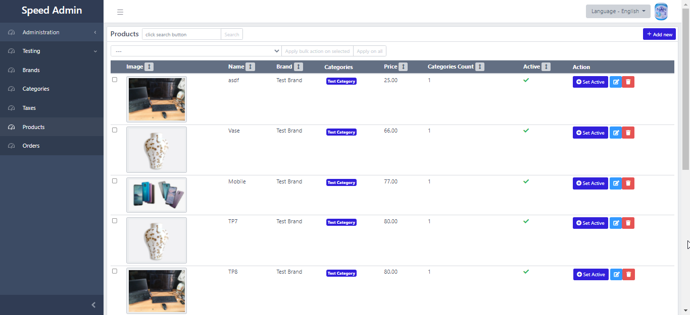
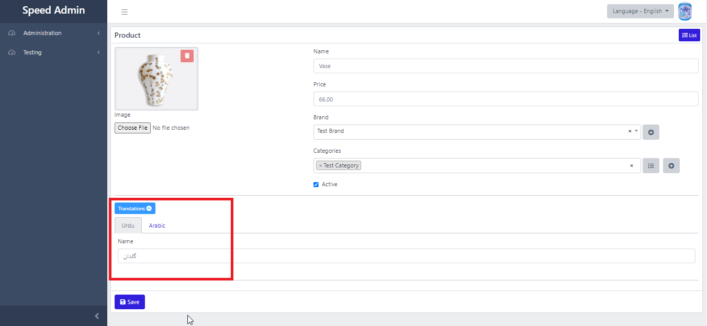

# Speed Admin

**A rapid application development framework** for Laravel 8+. It has built in Users Management with Roles and Permissions. It speeds up the development of CRUD functionality \(adding data tables and forms\).

Easy to create data tables \(grid\)



Easy to add Forms with **translations support**



## Documentation

[https://minaammunir.gitbook.io/speed-admin/](https://minaammunir.gitbook.io/speed-admin/)

## Installation

Install via composer

```bash
composer require muhammad-inaam-munir/speed-admin
```

### Publish package assets

```bash
php artisan vendor:publish --provider="MuhammadInaamMunir\SpeedAdmin\ServiceProvider"
```

### Add alias in app.php \(Optional\):

```php
'SpeedAdminHelpers' => MuhammadInaamMunir\SpeedAdmin\Facades\SpeedAdminHelpersFacade::class,
```

### Run following commands

```bash
php artisan config:cache
php artisan config:clear
php artisan clear-compiled
composer dump autoload
```

### Run the following command to create the admin user

```bash
php artisan speed-admin:create-admin-user
```

## Credits: thanks to the following packages

* spatie/laravel-translatable
* coreui

## License

MIT

