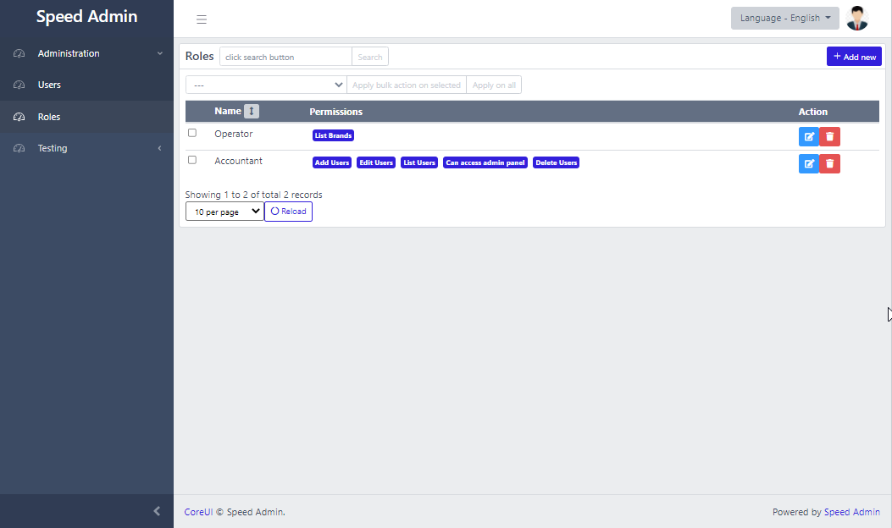

# Features

## Users Management

## Roles and Permissions

## Manage Settings

You can add custom settings for your application. See the following image for example, in this example, we are managing website slider images and website announcement.

## Easily add Grids

It is very easy to add Grids with the following features:

* Pagination
* Multi-column ordering
* Search
* Bulk Actions

## Easily add Complex Forms

It is very easy to add complex forms by just specifying a list of fields in the model.

> ### Speed-admin also supports "repeater" field. Also it supports repeater inside repeater.

## Translatable Fields

