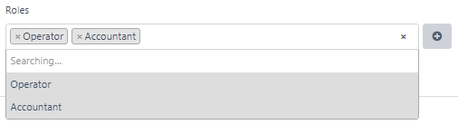

# belongsToMany



```php
$this->addFormItem([
    'id' => 'categories',
    'parent_id' => 'right-col',
    'type' => 'belongsToMany',
    'relation_name' => 'categories',
    'model' => '\App\Models\Category',
    'where' => function($query){
        return $query->where('is_active', 1);
    },
    'show_select_from_table_button' => true,
    'show_add_new_button' => true,
    'validation_rules' => ['categories' => 'required|array|min:1'],
    'label' => __('Categories'),
    'name' => 'categories'
]);
```

