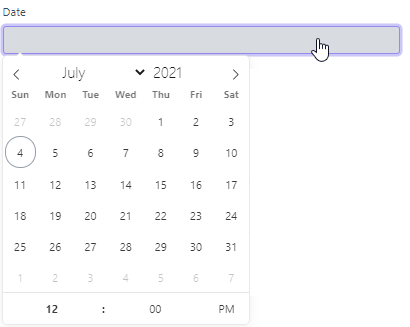

# datetime



```php
$this->addFormItem([
    'id' => 'date',
    'parent_id' => 'left-col',
    'type' => 'datetime',
    'enable_time' => true,
    'validation_rules' => [
        'date' => 'required|date'
    ],
    'label' => __('Date'),
    'name' => 'date'
]);
```

