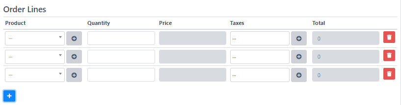
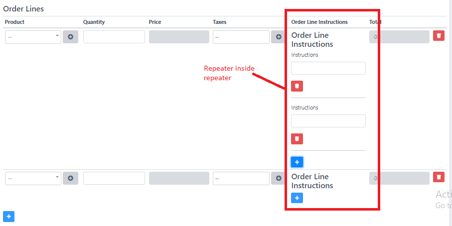

# repeater


The "repeater" field supports another "repeater" inside it.



The "repeater" field supports two types of view: 1. table, 2. non-table


```php
'table_view' => true

```





Code starting at line 3 is creating a repeater field. Then code starting from line 15 is adding fields inside the repeater. At line 71, we are adding another repeater.

```php
/////////////////////////////////////
// repeater field
$this->addFormItem([
    'id' => 'order_lines',
    'parent_id' => null,
    'type' => 'repeater',
    'relation_name' => 'orderLines',
    'model' => '\App\Models\OrderLine',
    'label' => __('Order Lines'),
    'table_view' => true,
]);

/////////////////////////////////////
// fields inside rep
$this->addFormItem([
    'id' => 'product',
    'parent_id' => 'order_lines',
    'type' => 'belongsTo',
    'relation_name' => 'product',
    'model' => '\App\Models\Product',
    'where' => function($query){
        return $query->where('is_active', 1);
    },
    'validation_rules' => [
        'product' => 'required|array', 
        'product.*' => 'required'
    ],
    'label' => __('Product'),
    'name' => 'product',
    'show_add_new_button' => true,
]);

$this->addFormItem([
    'id' => 'quantity',
    'parent_id' => 'order_lines',
    'type' => 'decimal',
    'validation_rules' => [
        'quantity' => 'required|array',
        'quantity.*' => 'required|numeric'
    ],
    'label' => __('Quantity'),
    'name' => 'quantity'
]);

$this->addFormItem([
    'id' => 'price',
    'parent_id' => 'order_lines',
    'type' => 'decimal',
    'validation_rules' => [
        'price' => 'required|array',
        'price.*' => 'required|numeric'
    ],
    'readonly' => true,
    'label' => __('Price'),
    'name' => 'price'
]);

$this->addFormItem([
    'id' => 'taxes',
    'parent_id' => 'order_lines',
    'type' => 'belongsToMany',
    'relation_name' => 'taxes',
    'model' => '\App\Models\Tax',
    'label' => __('Taxes'),
    'name' => 'taxes',
    'show_add_new_button' => true,
]);

/////////////////////////////////
// another reapeater inside main repeater
$this->addFormItem([
     'id' => 'order_lines_instructions',
     'parent_id' => 'order_lines',
     'type' => 'repeater',
     'relation_name' => 'instructions',
     'model' => '\App\Models\OrderLineInstruction',
     'label' => __('Order Line Instructions'),
     'table_view' => false,
]);

$this->addFormItem([
    'id' => 'instruction',
    'parent_id' => 'order_lines_instructions',
    'type' => 'text',
    'validation_rules' => [
        'instruction' => 'required|array'
    ],
    'label' => __('Instructions'),
    'name' => 'instruction'
]);

$this->addFormItem([
    'id' => 'total',
    'parent_id' => 'order_lines',
    'type' => 'decimal',
    'label' => __('Total'),
    'readonly' => true,
    'display_only' => true,
    'name' => 'total'
]);
```

