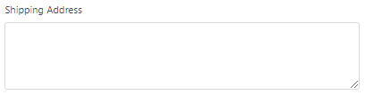

# textarea



```php
$this->addFormItem([
    'id' => 'shipping_address',
    'parent_id' => 'right-col',
    'type' => 'textarea',
    'validation_rules' => [
        'shipping_address' => 'required'
    ],
    'label' => __('Shipping Address'),
    'name' => 'shipping_address'
]);
```

