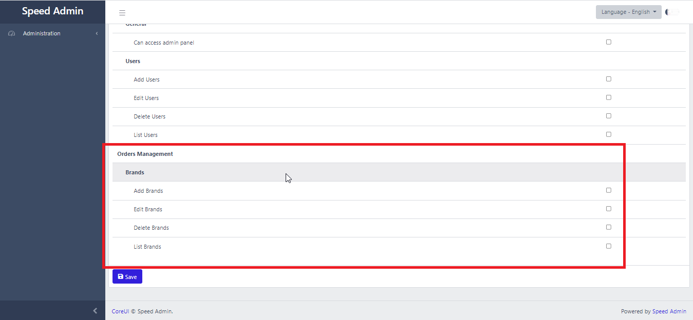
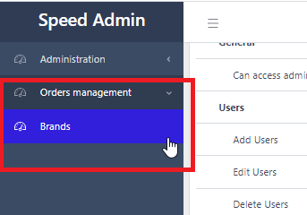
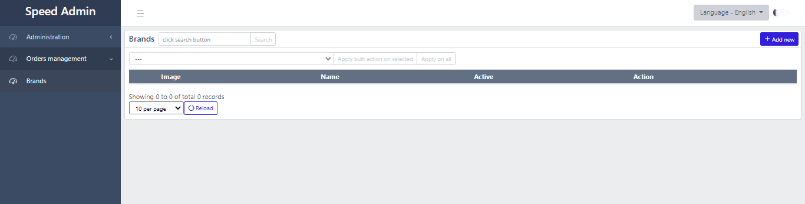
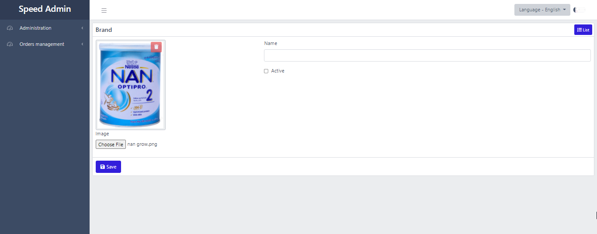

# Brands CRUD

## Create database table through database migration

In root folder of your project, run the following command in the terminal to create model and migration for \`brands\` database table.

```text
php artisan make:model Brand -m
```

Add the following code to the `up()` function of the `brands` table migration file.

```php
...

public function up()
{
    Schema::create('brands', function (Blueprint $table) {
        
        $table->id();
        $table->timestamps();
        
        // column to store image path
        $table->string('image')->nullable();
        
        // column to store brand name
        $table->string('name')->unique();
        
        // column to specify if brand is active or not
        $table->boolean('is_active')->default(true);
        
        // columns for storing created_by, updated_by, craeted_at 
        // and updated_at
        SpeedAdminHelpers::createdByUpdatedByMigrations($table);
    });
}
...
```

Run command `php artisan migrate` to create the "brands" database table.

## Add CRUD functionality to Brand Model

Add the following code to Brand.php \(model file\). See comments in the following code for more information.

```php
<?php

namespace App\Models;

use Illuminate\Database\Eloquent\Factories\HasFactory;
use Illuminate\Database\Eloquent\Model;

// This trait contains CRUD related functions
use MuhammadInaamMunir\SpeedAdmin\Traits\Crud;

// This class contains Grid (datatable) related functions
use MuhammadInaamMunir\SpeedAdmin\Misc\GridHelper;

class Brand extends Model
{
    use HasFactory, Crud;   // add Crud

    // Add text attribute to the model
    protected $appends = ['text'];
    public function getTextAttribute()
    {
        return $this->name;
    }

    // Add a constructor. 
    // We will initialize CRUD functionality in constructor
    public function __construct()
    {
        parent::__construct();

        $this->setSingularTitle('Brand');
        $this->setPluralTitle('Brands');

        // speed-admin will create model's (Add/Edit/Delete/List) permissions
        // based on this permissionId.
        // if we set permission id 'brand', then speed-admin will create following permissoins:
        // (brand-add, brand-edit, brand-delete, brand-list)
        $this->setPermissionId('brand');

        // call function to add Grid columns
        $this->addGridColumns();

        // call function to add Form fields
        $this->addFormFields();
    }

    // we can customize query to show Grid(datatable)
    public function getGridQuery()
    {
        return $this;
    }

    public function addGridColumns()
    {
        // we will add code of this function in next part of documentation
    }

    public function addFormFields()
    {
        // we will add code of this function in next part of documentation
    }
}

```

## Add columns for Grid \(datatable\):

Add following code to function `addGridColumns()` . In the following code, we are adding three columns to be shown in the grid \(datatable\).

```php
public function addGridColumns()
{
    $this->addGridColumn([
        'id' => 'image', 
        'title' => __('Image'), 
        'render_function' => function ($brand) {
            return GridHelper::renderImage($brand->image);
        }
    ]);
    $this->addGridColumn([
        'id' => 'name', 
        'title' => __('Name'), 
        'render_function' => function ($brand) {
            return $brand->name;
        }
    ]);
    $this->addGridColumn([
        'id' => 'is_active', 
        'title' => __('Active'), 
        'render_function' => function ($brand) {
            return GridHelper::renderBoolean($brand->image);
        }
    ]);
}
```

## Add permissions for Brands \(Add/Edit/Delete/List\)

Add the following code in the **boot\(\)** function in **AppServiceProvider.php** to add permissions related to the brand entity.

```php
public function boot()
{
    ...
    
    // this function will add permissions
    // define this function below
    $this->addPermissions();
}

private function addPermissions()
{
    $permissions = $this->app->make('speed-admin-permissions');

    $permissions->addModelPermissions(
        'Orders Management',
        \App\Models\Brand::class,
        true,
        true,
        true,
        true
    );
}
```

Visit **localhost:8000/admin/roles/create** and you can see the permissions:



## Add BrandController

Run the following command in the terminal to create BrandController

```bash
php artisan make:controller BrandController
```

Update BrandController.php file as shown below:


```php
<?php

namespace App\Http\Controllers;

use Illuminate\Http\Request;

// base controller, it handles all CRUD functionality
use MuhammadInaamMunir\SpeedAdmin\Http\Controllers\SpeedAdminBaseController;

// Brand model
use App\Models\Brand;

class BrandController extends SpeedAdminBaseController
{
    protected $model = Brand::class;
    protected $index_url = 'admin/brands';
}

```


## Add menu for brands

Add the following code in the **boot\(\)** function in **AppServiceProvider.php** to add menu:

```php
public function boot()
{
    ...
    ...
    ...
    
    $this->setMenu();
}

private function setMenu()
{
    $menu = $this->app->make('speed-admin-menu');
    
    // add parent menu
    $menu->addMenu('side-bar', [
        'id' => 'orders-management',
        'parent_id' => null,
        'before_id' => null,
        'title' => __('Orders management'),
        'icon' => 'cil-speedometer',
        'permission' => null 
    ]);

    // add brand menu
    $menu->addMenu('side-bar', [
        'id' => 'brands-list',
        'parent_id' => 'orders-management',
        'before_id' => null,
        'title' => __('Brands'),
        'icon' => 'cil-speedometer',
        'permission' => null,
        'href' => url(config('speed-admin.admin_url')) . '/brands',
    ]);
}
```



## Add route for brands

Add route in web.php \(routes\web.php\).


```php
use App\Http\Controllers\BrandController;

...
...


// Route Group
Route::middleware(['web', 'admin_auth', 'language'])
->prefix(config('speed-admin.admin_url'))
->name('admin.')
->group(function () {

    // Brand Routes    
    Route::resource('brands', BrandController::class);
    Route::get('brands-data', [BrandController::class, 'getData']);
    
});
```


Now you can click on "Brands" menu to see Grid for Brand entity:



## Add Brand Form fields

Add the following code to **addFormFields\(\)** function in **Brand.php \(model\).** All  following code is easy to understand.

```php
public function addFormFields()
{
    // bootstrap row (optional)
    $this->addFormItem([
        'id' => 'main-row',
        'type' => 'div',
        'class' => 'row'
    ]);

    // bootstrap column (optional)
    // this column will be shown on left side and
    // it will show image field
    $this->addFormItem([
        'id' => 'left-col',
        'parent_id' => 'main-row',
        'type' => 'div',
        'class' => 'col-md-4'
    ]);

    // bootstrap column (optional)
    // this column will be shown on right side and
    // it will show fields other than image
    $this->addFormItem([
        'id' => 'right-col',
        'parent_id' => 'main-row',
        'type' => 'div',
        'class' => 'col-md-8'
    ]);

    // image field
    $this->addFormItem([
        'id' => 'image',
        'parent_id' => 'left-col',
        'type' => 'image',
        'label' => __('Image'),
        'name' => 'image',
        'upload_path' => 'brands',
        'validation_rules' => ['image' => 'required|image|max:2048'],
    ]);

    // name field
    $this->addFormItem([
        'id' => 'name',
        'parent_id' => 'right-col',
        'type' => 'text',
        'validation_rules' => ['name' => 'required|unique:brands,name,{{$id}}'],
        'label' => __('Name'),
        'name' => 'name'
    ]);

    // is_active field
    $this->addFormItem([
        'id' => 'is_active',
        'parent_id' => 'right-col',
        'type' => 'checkbox',
        'label' => __('Active'),
        'name' => 'is_active',
    ]);
}
```

Now click on "Add New" button in brands page or visit **localhost:8000/admin/brands/create**. You can see the following form:




