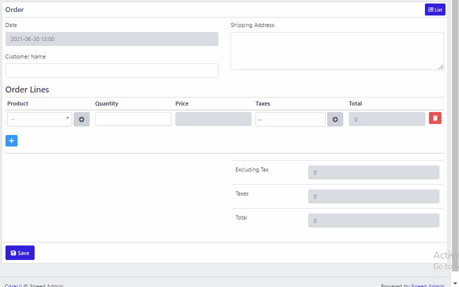

# Orders CRUD

This form is complicated. It has a repeater field for adding product lines. And it also has javascript to calculate Totals.


All other things \(Adding controller, routes, etc are the same as explained in Brands CRUD tutorial\)




## Add form fields

All other fields are simple. Please note how we added the repeater field \(id = order\_lines\). All the repeater fields \(product, quantity, price, taxes, total\) have their parent\_id set to the id of repeater i.e. **`order_lines`**

Also, note that we added custom HTML for showing order TOTALS.


```php
...

public function __construct()
{
    ...

    $this->addFormFields()

    ...
}

public function addFormFields()
{
    $this->addFormItem([
        'id' => 'main-row',
        'type' => 'div',
        'class' => 'row'
    ]);
    $this->addFormItem([
        'id' => 'left-col',
        'parent_id' => 'main-row',
        'type' => 'div',
        'class' => 'col-md-6'
    ]);
    $this->addFormItem([
        'id' => 'right-col',
        'parent_id' => 'main-row',
        'type' => 'div',
        'class' => 'col-md-6'
    ]);

    $this->addFormItem([
        'id' => 'date',
        'parent_id' => 'left-col',
        'type' => 'datetime',
        'enable_time' => true,
        'validation_rules' => [
            'date' => 'required|date'
        ],
        'label' => __('Date'),
        'name' => 'date'
    ]);

    $this->addFormItem([
        'id' => 'customer_name',
        'parent_id' => 'left-col',
        'type' => 'text',
        'validation_rules' => [
            'customer_name' => 'required'
        ],
        'label' => __('Customer Name'),
        'name' => 'customer_name'
    ]);

    $this->addFormItem([
        'id' => 'shipping_address',
        'parent_id' => 'right-col',
        'type' => 'textarea',
        'validation_rules' => [
            'shipping_address' => 'required'
        ],
        'label' => __('Shipping Address'),
        'name' => 'shipping_address'
    ]);

    $this->addFormItem([
        'id' => 'order_lines',
        'parent_id' => null,
        'type' => 'repeater',
        'relation_name' => 'orderLines',
        'model' => '\App\Models\OrderLine',
        'label' => __('Order Lines'),
        'table_view' => true,
    ]);

    $this->addFormItem([
        'id' => 'product',
        'parent_id' => 'order_lines',
        'type' => 'belongsTo',
        'relation_name' => 'product',
        'model' => '\App\Models\Product',
        'where' => function($query){
            return $query->where('is_active', 1);
        },
        'validation_rules' => [
            'product' => 'required|array', 
            'product.*' => 'required'
        ],
        'label' => __('Product'),
        'name' => 'product',
        'show_add_new_button' => true,
    ]);

    $this->addFormItem([
        'id' => 'quantity',
        'parent_id' => 'order_lines',
        'type' => 'decimal',
        'validation_rules' => [
            'quantity' => 'required|array',
            'quantity.*' => 'required|numeric'
        ],
        'label' => __('Quantity'),
        'name' => 'quantity'
    ]);

    $this->addFormItem([
        'id' => 'price',
        'parent_id' => 'order_lines',
        'type' => 'decimal',
        'validation_rules' => [
            'price' => 'required|array',
            'price.*' => 'required|numeric'
        ],
        'readonly' => true,
        'label' => __('Price'),
        'name' => 'price'
    ]);

    $this->addFormItem([
        'id' => 'taxes',
        'parent_id' => 'order_lines',
        'type' => 'belongsToMany',
        'relation_name' => 'taxes',
        'model' => '\App\Models\Tax',
        'label' => __('Taxes'),
        'name' => 'taxes',
        'show_add_new_button' => true,
    ]);

    $this->addFormItem([
        'id' => 'instruction',
        'parent_id' => 'order_lines_instructions',
        'type' => 'text',
        'validation_rules' => [
            'instruction' => 'required|array'
        ],
        'label' => __('Instructions'),
        'name' => 'instruction'
    ]);

    $this->addFormItem([
        'id' => 'total',
        'parent_id' => 'order_lines',
        'type' => 'decimal',
        'label' => __('Total'),
        'readonly' => true,
        'display_only' => true,
        'name' => 'total'
    ]);


    // ADD SOME CUSTOM HTML
    // This html is for showing order TOTALS    
    $this->addFormItem([
        'id' => 'order_totals',
        'parent_id' => null,
        'type' => 'html',
        'html' => <<<EOL
        <hr>
        <div class="row">
            <div class="col-md-6 offset-md-6">

                <table class="table totals">
                    <tbody>
                        <tr>
                            <td>Excluding Tax</td>
                            <td><input class="form-control excluding-tax" readonly></td>
                        </tr>

                        <tr>
                            <td>Taxes</td>
                            <td><input class="form-control taxes" readonly></td>
                        </tr>

                        <tr>
                            <td>Total</td>
                            <td><input class="form-control total" readonly></td>
                        </tr>
                    </tbody>
                </table>

            </div>
        </div>
        EOL
    ]);

}

...
```


## Add Javascript

Adding javascript to forms is simple. Please see the following sample code



```php
public function __construct()
{
    ...

    $this->addJavascript()

    ...
}

public function addJavascript()
{
    $this->addFormItem([
        'id' => 'some_script_id',
        'parent_id' => null,
        'type' => 'html',
        'html' => <<<EOL
        <script>

        (function () {

            // This is current form object
            let form = document.currentScript.closest('form');

            // ADD YOUR SCRIPT HERE

        })();

        </script>
        EOL
    ]);
}
```



### Following is the actual javascript for Orders Form

```php
public function __construct()
{
    ...

    $this->addJavascript()

    ...
}

public function addJavascript()
{
    $this->addFormItem([
        'id' => 'order_lines_script',
        'parent_id' => null,
        'type' => 'html',
        'html' => <<<EOL
        <script>

        (function () {
            let form = document.currentScript.closest('form');

            // SCRIPT CODE STARTS HERE

            $(form).on('select2:select', function (e) {
                let input = e.target
                var data = e.params.data;

                if( input.name.startsWith('product[') )
                {
                    let priceInput = $(input).closest('tr').find('[name^="price["]');
                    priceInput.val(data.price);
                }
            });

            $(form).on('select2:clear', function (e) {
                let input = e.target
                if(input.name.startsWith('product[') )
                {
                    let priceInput = $(input).closest('tr').find('[name^="price["]');
                    priceInput.val(0);
                }
            });

            function calculateOrderTotals(orderForm){

                var taxesGrandTotal = 0;
                var grandTotal = 0;

                var trs = orderForm.querySelectorAll('table.order_lines tbody tr:not(.template)');
                for(var i = 0; i < trs.length; i++)
                {
                    var tr = trs[i];
                    var priceInput = tr.querySelector('[name^="price["]')
                    var price = priceInput ? priceInput.value : 0;
                    var quantityInput = tr.querySelector('[name^="quantity["]');
                    var quantity = quantityInput ? quantityInput.value : 0;
                    var beforeTax = price * quantity;

                    var taxes = $(tr).find('[name^="taxes["]').select2('data');
                    var calculatedTax = 0;

                    if (taxes) {
                        for(var j = 0; j < taxes.length; j++)
                        {
                            var tax = taxes[j];
                            calculatedTax += beforeTax * tax.rate / 100;
                        }
                    }

                    taxesGrandTotal += calculatedTax;
                    grandTotal += beforeTax + calculatedTax;
                    tr.querySelector('[name^="total["]').value = beforeTax + calculatedTax;
                }

                document.querySelector('table.totals .excluding-tax').value = grandTotal - taxesGrandTotal;
                document.querySelector('table.totals .taxes').value = taxesGrandTotal;
                document.querySelector('table.totals .total').value = grandTotal;
            }

            var intervalId = setInterval(() => {
                if (!document.body.contains(form))
                {
                    clearInterval(intervalId);
                }
                calculateOrderTotals(form);
            }, 1000);

            // SCRIPT CODE ENDS HERE

        })();

        </script>
        EOL
    ]);
}
```

