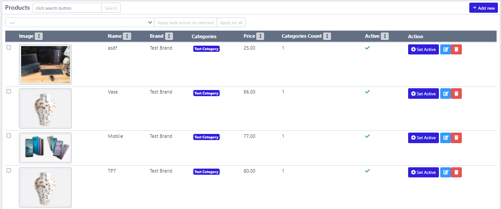
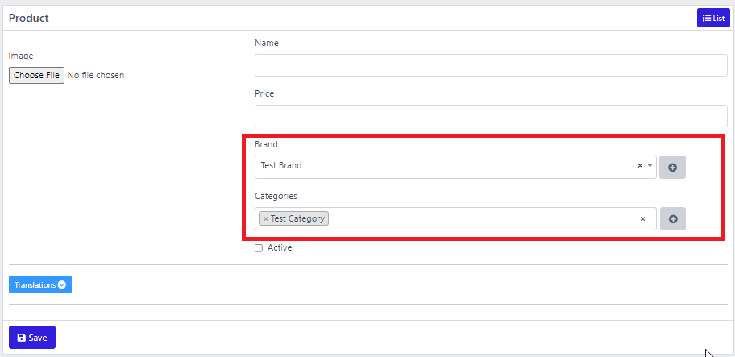

# Products CRUD

Everything is the same as creating CRUD for Brands except few things. We will only discuss **NEW** things here.


All other things \(Adding controller, routes, etc are the same as explained in Brands CRUD tutorial\)


## Database migration for products table:

```php
php artisan make:model Product -m
```

```php
public function up()
{
    Schema::create('products', function (Blueprint $table) {
        $table->id();

        $table->string('image')->nullable();
        $table->string('name')->unique();
        $table->foreignId('brand_id');
        $table->decimal('price');
        $table->boolean('is_active')->default(true);

        SpeedAdminHelpers::createdByUpdatedByMigrations($table);

        $table->timestamps();
    });
}
```

## Database migration for "category\_product" table for many\_to\_many relation between products and categories

```php
php artisan make:migration create_table_category_product --create=category_product
```

```php
public function up()
{
    Schema::create('category_product', function (Blueprint $table) {
        $table->id();
        $table->foreignId('product_id');
        $table->foreignId('category_id');
        $table->timestamps();
    });
}
```

## Add relations in Product Model


```php
public function brand()
{
    return $this->belongsTo(Brand::class);
}

public function categories()
{
    return $this->belongsToMany(Category::class);
}
```


## Add getGridQuery\($request\) function to product model



As shown in the image above, in the products grid \(datatable\) we want to show tje following columns:

* Product name
* Image
* Brand name
* Categories names
* Price
* Categories count
* Active

We also want to make sure that we can **search** products by brand\_name or categories names. To do this, we need to modify our query. Our getGridQuery\(\) function will look like following.


```php
...
public function getGridQuery($request)
{
    $query = $this->with(['brand', 'categories'])
        ->leftJoin('brands', 'brands.id', '=', 'products.brand_id')
        ->leftJoin('category_product', 'category_product.product_id', '=', 'products.id')
        ->leftJoin('categories', 'categories.id', '=', 'category_product.category_id')
        ->select([
            'products.id',
            'products.image',
            'products.name',
            'products.brand_id',
            'products.price',
            'products.is_active', 
            'brands.name as brand_name', 
            \DB::raw('count(categories.id) as categories_count')
        ])
        ->groupBy([
            'products.id',
            'products.image',
            'products.name',
            'products.brand_id',
            'products.price',
            'products.is_active',
            'brands.name',
        ]);

    return $query;
}
...
```


## Add Grid Columns


```php
public function __construct()
{
    ...

    $this->addGridColumns();

    ...
}

public function addGridColumns()
{
    $this->addGridColumn([
        'id' => 'image', 
        'title' => __('Image'), 
        'order_by' => 'products.image',
        'render_function' => function ($product) {
            return GridHelper::renderImage($product->image);
        }
    ]);
    $this->addGridColumn([
        'id' => 'name', 
        'title' => __('Name'),
        'order_by' => 'products.name', 
        'search_by' => 'products.name', 
        'render_function' => function ($product) {
            $default_locale = config('speed-admin.default_model_locale');
            return $product->name->{$default_locale};
        }
    ]);
    $this->addGridColumn([
        'id' => 'brand', 
        'title' => __('Brand'),
        'order_by' => 'brands.name',
        'search_by' => 'brands.name',
        'render_function' => function ($product) {
            return $product->brand_name;
        }
    ]);
    $this->addGridColumn([
        'id' => 'categories', 
        'title' => __('Categories'),
        'search_by' => 'categories.name', 
        'render_function' => function ($product) {
            $html = '';
            foreach ($product->categories as $category) {
                $html .= '<span class="badge badge-primary p-1 m-1">'.$category->name.'</span>';
            }
            return $html;
        }
    ]);
    $this->addGridColumn([
        'id' => 'price', 
        'title' => __('Price'),
        'order_by' => 'products.price', 
        'search_by' => 'products.price', 
        'render_function' => function ($product) {
            return $product->price;
        }
    ]);
    $this->addGridColumn([
        'id' => 'categories_count', 
        'title' => __('Categories Count'), 
        'order_by' => 'categories_count',
        'render_function' => function ($product) {
            return $product->categories_count;
        }
    ]);
    $this->addGridColumn([
        'id' => 'is_active', 
        'title' => __('Active'),
        'order_by' => 'products.is_active',
        'render_function' => function ($product) {
            return GridHelper::renderBoolean($product->is_active);
        }
    ]);
}
```


## Add form fields

All fields are the same as shown in Brands CRUD tutorial except for the following two fields \(see image below\):

* Select field for selecting Brand
* Select field for selecting multiple categories




```php
public function __construct()
{
    ...

    $this->addFormFields();

    ...
}

public function addFormFields()
{
    $this->addFormItem([
        'id' => 'main-row',
        'type' => 'div',
        'class' => 'row'
    ]);
    $this->addFormItem([
        'id' => 'left-col',
        'parent_id' => 'main-row',
        'type' => 'div',
        'class' => 'col-md-4'
    ]);
    $this->addFormItem([
        'id' => 'right-col',
        'parent_id' => 'main-row',
        'type' => 'div',
        'class' => 'col-md-8'
    ]);

    $this->addFormItem([
        'id' => 'image',
        'parent_id' => 'left-col',
        'type' => 'image',
        'label' => __('Image'),
        'name' => 'image',
        'upload_path' => 'products',
        'validation_rules' => ['image' => 'required|image|max:2048'],
    ]);

    $this->addFormItem([
        'id' => 'name',
        'parent_id' => 'right-col',
        'type' => 'text',
        'validation_rules' => ['name' => 'required|unique:products,name,{{$id}}'],
        'label' => __('Name'),
        'name' => 'name'
    ]);

    $this->addFormItem([
        'id' => 'price',
        'parent_id' => 'right-col',
        'type' => 'decimal',
        'validation_rules' => ['price' => 'required|numeric'],
        'label' => __('Price'),
        'name' => 'price'
    ]);

    $this->addFormItem([
        'id' => 'brand',
        'parent_id' => 'right-col',
        'type' => 'belongsTo',
        'relation_name' => 'brand',
        'model' => '\App\Models\Brand',
        'where' => function($query){
            return $query->where('is_active', 1);
        },
        'show_add_new_button' => true,
        'validation_rules' => ['brand' => 'required'],
        'label' => __('Brand'),
        'name' => 'brand'
    ]);

    $this->addFormItem([
        'id' => 'categories',
        'parent_id' => 'right-col',
        'type' => 'belongsToMany',
        'relation_name' => 'categories',
        'model' => '\App\Models\Category',
        'where' => function($query){
            return $query->where('is_active', 1);
        },
        'show_select_from_table_button' => true,
        'show_add_new_button' => true,
        'validation_rules' => ['categories' => 'required|array|min:1'],
        'label' => __('Categories'),
        'name' => 'categories'
    ]);

    $this->addFormItem([
        'id' => 'is_active',
        'parent_id' => 'right-col',
        'type' => 'checkbox',
        'label' => __('Active'),
        'name' => 'is_active',
    ]);
}
```


